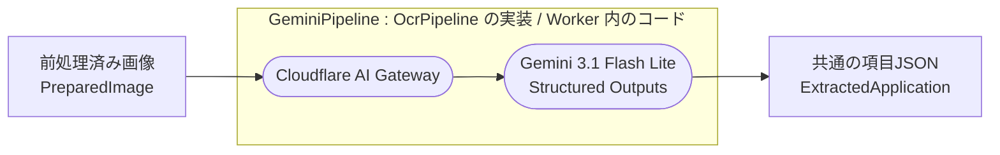
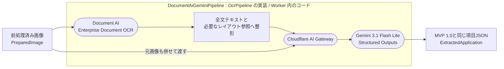

# 外部OCR・AI API（Gemini / Document AI / AI Gateway）

> 正典化元: 要件定義書 v1.11 §8・付録（原本は `knowledge/ref/doc/claude_code_要件定義_v1.11.md`）

## リリース方針

| 製品版 | Pass①（読取） | Pass②（業務チェック） |
|---|---|---|
| **MVP 1.0** | 元画像 → Gemini → 項目JSON | 抽出項目 → Gemini → 業務チェックJSON |
| **MVP 1.1** | 元画像 → Document AI → OCR文字・レイアウト＋元画像 → Gemini → 項目JSON | 抽出項目 → Gemini → 業務チェックJSON |

- MVP 1.0を本線として先に完成させる。
- MVP 1.1のDocument AIはGeminiを置き換えず、Pass①の前処理として文字・レイアウト認識を補助する。
- 画面、`POST /api/ocr/extract`、最終JSONスキーマ、申請の保存形式は両版で共通とする。
- 構成はデプロイ環境の `OCR_PIPELINE_MODE` で固定し、利用者には選択させない。

## 処理フロー

### MVP 1.0



> 角丸が**外部サービス**、四角が **Worker 内で扱う値**、枠が `OcrPipeline` 実装の責務範囲。
> `POST /api/ocr/extract` のハンドラは枠の中を知らず、`extract()` を呼ぶだけである（F-2-13・NF-4-2）。

### MVP 1.1



> 角丸が**外部サービス**、四角が **Worker 内で扱う値・処理**、枠が `OcrPipeline` 実装の責務範囲。
> **Document AI の生レスポンス全体は Gemini へ渡さない**（整形は枠の内側で行う）。画面・API・保存形式は 1.0 と同一である（F-2-13）。

Document AIの生レスポンス全体はGeminiへ渡さない。全文テキストと文字・段落等の必要なレイアウト参照だけに整形し、元画像も併せて渡す。元画像を残すのは、Document AIの誤読をGeminiが画像から再確認できるようにするためである。

## 責任境界

| 処理 | MVP 1.0 | MVP 1.1 |
|---|---|---|
| 文字・レイアウト認識 | Gemini | Document AIが補助し、Geminiが元画像も参照して最終判断 |
| 帳票種別判別 | Gemini | Gemini |
| ラベルと値の対応付け | Gemini | Gemini |
| 確信度付与 | Gemini | Gemini |
| 最終JSONのスキーマ保証 | Gemini Structured Outputs | Gemini Structured Outputs |
| 業務チェック・トリアージ | Gemini | Gemini |

Document AI単独の出力を業務データとして保存しない。永続化するのは、Geminiが生成した最終抽出項目と既存仕様の原本画像だけである。

## 採用モデル

**Gemini 3.1 Flash Lite** を両版のPass①・Pass②に採用する。モデルIDは `GEMINI_MODEL` で設定し、コードへハードコードしない。

### 選定根拠

日本語手書きOCRに特化した23モデルの比較評価において、Gemini 系が上位を占めている。

| 順位 | モデル | NLSスコア |
|---:|---|---:|
| 1 | Gemini 3.1 Pro Preview | 0.924 |
| 2 | Gemini 3 Flash Preview | 0.918 |
| **3** | **Gemini 3.1 Flash Lite** | **0.899** |
| 4 | Claude 4.6 Opus | 0.897 |
| 6 | Google Cloud Vision | 0.820 |

Flash Liteは最上位のProとの精度差が0.024でありながら、速度と費用でデモに適する。出典: [Hunting for an OCR That Can Transcribe Japanese Handwriting: I Tried 23 Models](https://nyosegawa.com/en/posts/japanese-handwriting-ocr-comparison/)

## コスト

2026-08-20時点の料金を前提とする。

| 項目 | MVP 1.0 | MVP 1.1 |
|---|---|---|
| Gemini単価 | 入力 $0.25／出力 $1.50（100万トークン） | 同左。OCRテキスト分だけ入力が増える |
| Gemini 1枚あたり試算 | 約0.5円（Pass① 約0.26円＋Pass② 約0.19円） | 実装後に計測。1.0料金＋OCRテキスト入力分 |
| Document AI Enterprise OCR | 使用しない | 月1,000ページまで無料。超過後は月500万ページまで $1.50／1,000ページ |
| 月100枚想定 | 約50円 | Document AIは無料枠内。Gemini追加入力分を除けば約50円相当 |

本デモは1申請＝1画像、月約100枚のため、Document AI料金は無料枠内に収まる見込みである。ただし無料枠はアカウント単位・月単位であり、他用途との合算と料金改定を運用時に確認する。

出典: [Gemini料金](https://cloud.google.com/gemini-enterprise-agent-platform/generative-ai/pricing)、[Document AI料金](https://cloud.google.com/products/document-ai/pricing)

> 課金の歯止めはアプリケーション側の月次カウンタ（`MAX_OCR_PAGES_PER_MONTH` / `MAX_GEMINI_CALLS_PER_MONTH`）とCloudflare AI Gatewayの予算上限を使用する。ただしAI Gatewayの上限はDocument AI料金を制御しないため、MVP 1.1ではGoogle Cloud Billingの予算アラートも設定する。予算アラートは自動停止ではない。[AI呼び出し回数の上限](../requirements/non-functional.md#ai呼び出し回数の上限アプリケーション側)を参照。

## 実装設計

### OCR Pipeline境界

```ts
interface OcrPipeline {
  extract(image: PreparedImage): Promise<ExtractedApplication>;
}

class GeminiPipeline implements OcrPipeline {}
class DocumentAiGeminiPipeline implements OcrPipeline {}
```

- `/api/ocr/extract` は `OcrPipeline.extract()` だけを呼び、プロバイダ固有コードを持たない。
- `OCR_PIPELINE_MODE=gemini` で `GeminiPipeline`、`document-ai-gemini` で `DocumentAiGeminiPipeline` を起動時に生成する。
- 未設定・未知のモードは起動失敗とし、リクエスト単位の切り替えは行わない。
- 両実装は同じ `ExtractedApplication` とJSON Schemaを使用する。

### 外部呼び出し

**AI GatewayはBYOK構成のGoogle AI Studio互換エンドポイント（Universal Endpoint）を使用し、Workers AIバインディング（`env.AI`）は経由しない。** エンドポイントURLは `https://gateway.ai.cloudflare.com/v1/{AI_GATEWAY_ACCOUNT_ID}/{AI_GATEWAY_ID}/google-ai-studio/v1beta/models/{GEMINI_MODEL}:generateContent` の形で、`GEMINI_API_KEY` を `x-goog-api-key` ヘッダに、`cf-aig-collect-log-payload: false` をAI-7aのペイロードログ無効化ヘッダとして付与する（判断記録 #20）。

**ID は正典化元の原本（要件定義書 v1.11 §8.3）に揃える。** 原本で重複している ID は枝番 `a` / `b` で区別する（[規約](#枝番-a--b-の規約と原本-83-の-id-重複)）。番号の欠番は、その項が本ページの散文にあることを意味する（[所在](#表に載せていない原本の-ai-x)）。

| ID | 方針 |
|---|---|
| [AI-1](../../ref/doc/claude_code_要件定義_v1.11.md#83-実装方針) | Gemini呼び出しはすべてCloudflare AI Gatewayを経由する。Document AIはGoogle Cloudの認証済みREST APIへ直接送信する |
| [AI-2](../../ref/doc/claude_code_要件定義_v1.11.md#83-実装方針) | AI Gatewayのキャッシュを有効化する。1.1ではGemini応答だけが対象であり、Document AI呼び出し自体を省略できるとは限らない |
| [AI-4](../../ref/doc/claude_code_要件定義_v1.11.md#83-実装方針) | Pass②は画像を必要とせず、Pass①のPipelineと独立させる |
| [AI-5](../../ref/doc/claude_code_要件定義_v1.11.md#83-実装方針) | Geminiの最大出力トークンは4,000とする |
| [AI-6](../../ref/doc/claude_code_要件定義_v1.11.md#83-実装方針) | GeminiのStructured Outputsで最終JSON形式を強制する |
| [AI-7a](../../ref/doc/claude_code_要件定義_v1.11.md#83-実装方針) | **AI Gatewayのペイロードログ収集を無効化する**（`cf-aig-collect-log-payload: false`）。メタデータの収集は維持する（NF-2-42・NF-2-43） |
| [AI-8a](../../ref/doc/claude_code_要件定義_v1.11.md#83-実装方針) | **Guardrailsを使用しない。** Workers AIのトークン推論として課金されるため（NF-2-44） |
| [AI-9a](../../ref/doc/claude_code_要件定義_v1.11.md#83-実装方針) | **ゲートウェイの「Workers AI 課金」は「標準課金」を選択する。** 統合課金はクレジットに5%の手数料が付き、BYOKでは不要（NF-2-45） |
| [AI-9b](../../ref/doc/claude_code_要件定義_v1.11.md#83-実装方針) | 1.1はDocument AIの同期処理で1画像だけを扱い、バッチ、Custom Extractor、Form Parser、OCRアドオンは使用しない |

#### 表に載せていない原本の AI-x

原本の §8.3 にあり本表に無い項は、失われたのではなく本ページの散文へ移してある。**原本の全15項がいずれかに対応する。**

| 原本の ID | 内容 | wiki 上の所在 |
|---|---|---|
| [AI-3](../../ref/doc/claude_code_要件定義_v1.11.md#83-実装方針) | `OcrPipeline.extract(image)` を単一の入口とし、ハンドラは実装を意識しない | [OCR Pipeline境界](#ocr-pipeline境界) |
| [AI-7b](../../ref/doc/claude_code_要件定義_v1.11.md#83-実装方針) | 失敗時は再試行を促すエラーを表示し、申請レコードは保持する | [エラーと再試行](#エラーと再試行) |
| [AI-8b](../../ref/doc/claude_code_要件定義_v1.11.md#83-実装方針) | 起動時に `OCR_PIPELINE_MODE` を検証し、対応するPipelineを生成する | [OCR Pipeline境界](#ocr-pipeline境界) |
| [AI-10](../../ref/doc/claude_code_要件定義_v1.11.md#83-実装方針) | Geminiへ渡すDocument AI情報を全文テキストとレイアウト参照に限定する | [処理フロー](#処理フロー) |
| [AI-11](../../ref/doc/claude_code_要件定義_v1.11.md#83-実装方針) | 1.1でもGeminiへ元画像を渡す | [処理フロー](#処理フロー) |
| [AI-12](../../ref/doc/claude_code_要件定義_v1.11.md#83-実装方針) | Document AI失敗時にGemini単体へ自動フォールバックしない | [エラーと再試行](#エラーと再試行) |

#### 枝番 a / b の規約と、原本 §8.3 の ID 重複

**原本の §8.3 には AI-7・AI-8・AI-9 がそれぞれ2つ存在する。** v1.10 で AI Gateway の3項（ペイロードログ無効化・Guardrails不使用・標準課金）を追加した際、既存の AI-7〜AI-12 を持つ表の**前半**へ AI-7・AI-8・AI-9 として挿入したためである（v1.9 までは AI-1〜AI-12 に重複はなかった）。

| 枝番 | 意味 |
|---|---|
| `a` | 原本 §8.3 で**先に現れる**組。v1.10 で追加された AI Gateway の3項 |
| `b` | 原本 §8.3 で**後に現れる**組。v1.5 から存在する3項 |

枝番を付けるのは AI-7・AI-8・AI-9 だけであり、他の ID は原本と1対1で対応する。

> **原本は修正しない。** [`knowledge/ref/doc/`](../../OKF.md) は「一度入れたら変更しない」原本の層であり、遡って書き換えると史実が追えなくなる。ID の重複は v1.10 で生じた事実として残し（v1.11 でも §8.3 は変更していない）、wiki 側は枝番で解決する。
>
> **`F-x` と `NF-x` に枝番は不要である。** 重複しているのは `AI-x` だけで、機能要件・非機能要件は原本と wiki で同じ番号を指す（確認済み）。
>
> **上表のリンクは原本 `knowledge/ref/doc/claude_code_要件定義_v1.11.md` を指すが、この層は Git 追跡外である**（`.gitignore`）。ローカルのクローンとエディタでは解決するが、**GitHub の Web UI では 404 になる。**

### エラーと再試行

- GeminiまたはDocument AIが失敗した場合は、再試行可能な読取エラーを返す。
- Document AI失敗時にGemini単体へ自動フォールバックしない。設定不良や1.0／1.1の精度差を隠さないためである。
- Document AI成功後にGeminiが失敗した場合、ユーザーの再試行ではPipeline全体を再実行する。中間OCR結果は永続化しない。
- 読取完了前に失敗した場合、未完成の申請レコードを新規作成しない。既存申請からの再実施では既存レコードを保持する。

## 設定と認証

| 設定 | MVP 1.0 | MVP 1.1 | 取扱い |
|---|---|---|---|
| `OCR_PIPELINE_MODE` | `gemini` | `document-ai-gemini` | 通常の環境変数 |
| `GEMINI_MODEL` | `gemini-3.1-flash-lite` | 同左 | 通常の環境変数 |
| `GEMINI_API_KEY` | 必須 | 必須 | Workers Secret |
| `AI_GATEWAY_ACCOUNT_ID` | 必須 | 必須 | 通常の環境変数 |
| `AI_GATEWAY_ID` | 必須 | 必須 | 通常の環境変数 |
| `GOOGLE_CLOUD_PROJECT_ID` | 不要 | 必須 | 通常の環境変数 |
| `DOCUMENT_AI_LOCATION` | 不要 | 必須 | 通常の環境変数 |
| `DOCUMENT_AI_PROCESSOR_ID` | 不要 | 必須 | 通常の環境変数 |
| `GOOGLE_SERVICE_ACCOUNT_EMAIL` | 不要 | 必須 | 通常の環境変数 |
| `GOOGLE_SERVICE_ACCOUNT_PRIVATE_KEY` | 不要 | 必須 | Workers Secret |

MVP 1.1では専用サービスアカウントを使い、対象ProcessorにDocument AI API User（`roles/documentai.apiUser`）だけを付与する。秘密鍵から取得したOAuthアクセストークンはメモリ上だけで扱い、ログやDBへ保存しない。サービスアカウントキーはデモ向けの構成であり、本番化時は短期資格情報を使うWorkload Identity Federation等を再検討する。

出典: [Document AI IAMロール](https://cloud.google.com/document-ai/docs/access-control/iam-roles)、[Google CloudのワークロードID](https://cloud.google.com/iam/docs/workload-identities)

## ログ・データ保護

- APIキー、サービスアカウント秘密鍵、OAuthアクセストークンをログへ出力しない。
- 元画像、Document AIリクエスト・レスポンス、OCR全文をアプリケーションログおよびAI Gatewayログへ出力しない。
- Document AIの生レスポンスとOCR全文をD1・R2へ永続化しない。
- 顧客の実データを使用せず、合成または十分に匿名化した帳票だけを処理する。

> **AI Gatewayのログは既定でリクエスト・レスポンス本文を保存する。** 無効化しない限り、Geminiへ送った**帳票の元画像がCloudflare側に蓄積される**。既定値に依存せず `cf-aig-collect-log-payload: false` を明示的に付与する（AI-7a・NF-2-42）。
>
> ペイロードを止めてもメタデータ（トークン数・モデル・プロバイダ・ステータスコード・費用・所要時間）は残るため、[コスト試算](./ai-cost-simulation.md)で保留している実トークン数の計測はこの構成のまま行える（NF-2-43）。ログのエントリ自体を止める `cf-aig-collect-log: false` は使用しない。

## 関連ページ

- [システム構成](./cloudflare-stack.md)
- [機能要件 F-2 帳票読取](../requirements/functional.md#f-2-帳票読取ocr)
- [非機能要件](../requirements/non-functional.md)
- [受け入れ基準](../requirements/acceptance.md#ocr業務チェック)
- [判断記録 #14](../requirements/decisions.md#確定事項)
