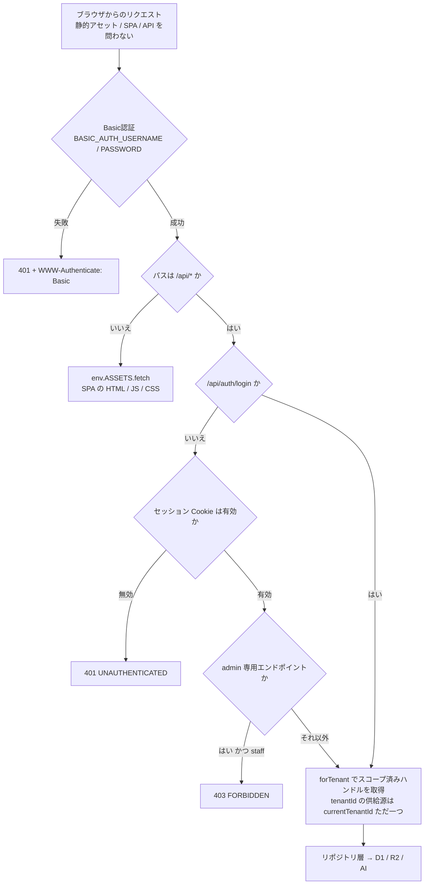
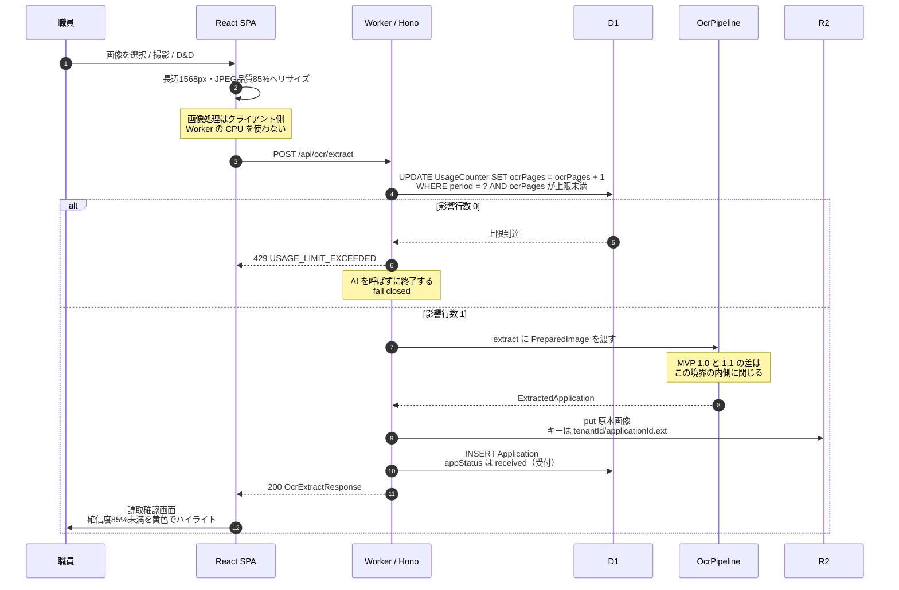
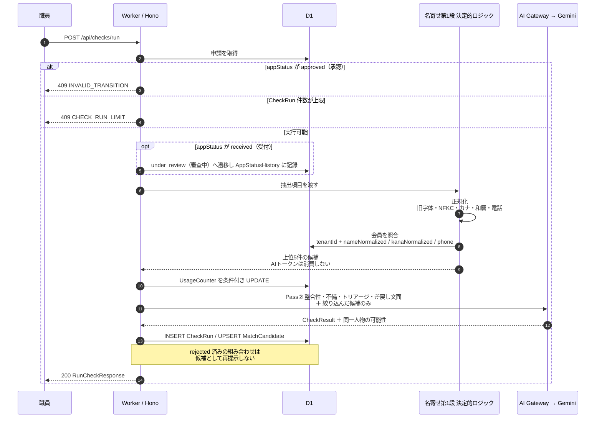
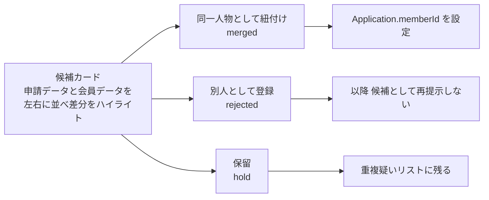
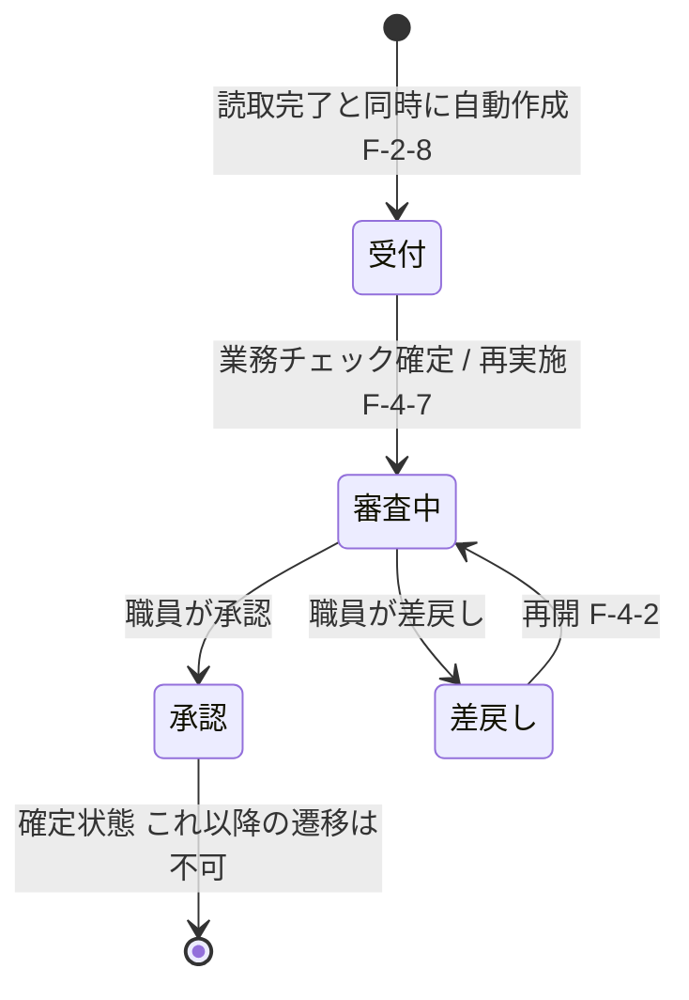
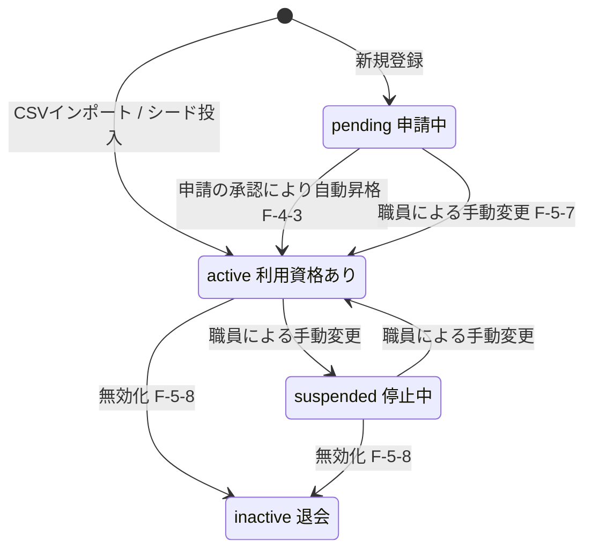
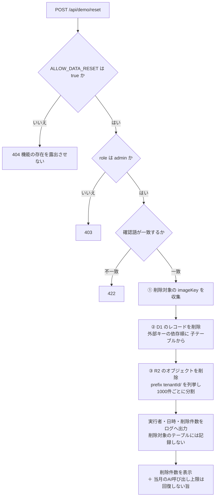
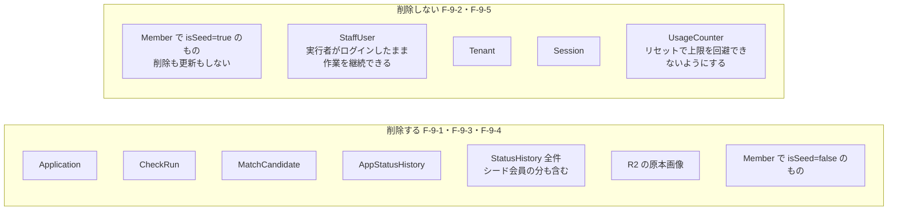
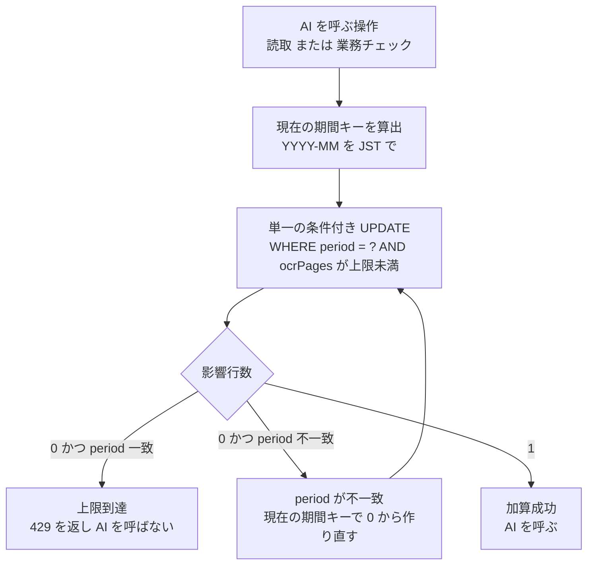

# データフロー

> **本ページは要件定義書の章を正典化したものではなく、[機能要件](../requirements/functional.md)・[非機能要件](../requirements/non-functional.md)・[外部OCR・AI API](./ai-api.md)から導出した設計である。** 各図の下に根拠の要件IDを示す。
>
> エンドポイントの定義は [APIエンドポイント仕様](./api.md)、型は [共有型定義](./types.md)。

## リクエストの通過順

すべてのリクエストが同じ順序で関門を通る。**この順序を崩すと F-1-11〜13・NF-2-27・NF-5-6 のいずれかに違反する。**

| 関門 | 根拠 | 崩したときに起きること |
|---|---|---|
| Basic認証が**静的アセットより前** | F-1-13・NF-2-27 | `run_worker_first = true` を設定しないと Static Assets が Worker より先に `index.html` を返し、**Basic認証が迂回される** |
| Basic認証の**後に**アプリ内ログイン | F-1-12・NF-2-28 | Basic認証だけで業務データへ到達できてしまう。Basic認証は職員識別・ロール認可を代替しない |
| ロール検証が**API側** | F-1-5・NF-2-11 | 画面の出し分けのみでは API 直接呼び出しで突破される |
| スコープ済みハンドル経由 | NF-5-6・NF-5-7 | テナント条件の付与が呼び出し側の記述に依存し、1箇所の書き忘れが他テナントの露出になる |

## 帳票読取（F-2）

**カウンタの加算は AI 呼び出しの前**であり、**上限判定は条件付き UPDATE の影響行数**で行う（NF-2-39）。読んでから判定して別途更新する実装にしてはならない。

| 段階 | 根拠 |
|---|---|
| クライアント側リサイズ | F-2-2（Worker の CPU 消費を避ける） |
| 加算をAI呼び出しの前に / 条件付きUPDATE | NF-2-39 |
| 上限到達時にAIを呼ばない | NF-2-16（fail closed） |
| `OcrPipeline` 境界の内側で 1.0 / 1.1 を切り替える | F-2-13・NF-4-2・NF-4-5 |
| 原本画像のキーに `tenantId` プレフィックス | NF-5-21 |
| 読取完了と同時に申請を保存（`received` / 受付） | F-2-8 |
| 確信度85%未満をハイライト | NF-4-3（閾値は定数）・screen-list.md |

**失敗時の扱い** — 読取完了前に失敗した場合、**未完成の申請レコードを作成しない**（ai-api.md）。カウンタは加算済みのまま戻さない（fail closed 側に倒す判断・NF-2-39 の限界）。

### OcrPipeline の内側（F-2-11・F-2-12）

**MVP 1.0 と 1.1 の差は `OcrPipeline` 境界の内側だけに閉じる。** 画面・`POST /api/ocr/extract` の入出力・申請の保存形式は両版で同一であり（F-2-13）、ハンドラは `extract()` だけを呼んでプロバイダ固有コードを持たない（NF-4-2）。切り替えは `OCR_PIPELINE_MODE` により起動時に決まり、リクエスト単位では行わない（NF-4-5・NF-2-38）。

**両版の内部フロー図は [外部OCR・AI API](./ai-api.md#処理フロー) にある**（同ページが外部AI呼び出しの正典であるため、本ページには再掲しない）。失敗時の扱い（F-2-14 の自動フォールバック禁止）、永続化しない対象（F-2-15）、AI Gateway のペイロードログ無効化（NF-2-42）も同ページを参照。

## AI業務チェックと名寄せ（F-3・F-6）

名寄せは**2段階**であり、**第1段では AI を呼ばない**（F-6-12）。会員全件を AI へ渡す方式は採用しない（F-6-6）。

| 段階 | 根拠 |
|---|---|
| `approved`（承認）済みでは実施不可 | F-4-6 |
| 再実施回数の上限 | NF-2-21（MVP は 5回） |
| `received`（受付）→ `under_review`（審査中）の自動遷移 | F-4-7 |
| 第1段は決定的・AI不使用 | F-6-1・F-6-3・F-6-12 |
| 照合は `tenantId` を先頭列とする複合インデックス | data-model.md・NF-5-13 |
| 上位5件のみ AI へ | F-6-4・F-6-5・F-6-6 |
| 実行結果を履歴として保存 | F-3-7・F-4-8 |
| `rejected` を再提示しない | F-6-10 |

> **`rejected` は AI へ渡す候補からも除外する。** 除外を UI 側だけで行うと、AIトークンを消費して「別人と判断済み」の候補を毎回再評価することになる。

### 職員の判断（F-6-8）

判断結果・判断者・日時を保存する（F-6-9）。**`Member` 自体は変更しない**（紐付けは `Application.memberId` の設定であるため）。

## 申請ステータスの遷移（F-4-1・F-4-2）

職員の決裁状態 `appStatus` と AI 判定 `triage` は**別軸**で保持する。**AI判定は決裁状態を自動的に変更しない。**

- `承認` からの遷移は**不可**（確定状態・F-4-2）。API は `409 INVALID_TRANSITION` を返す
- すべての変更を `AppStatusHistory` に記録する（変更者・日時・前後の状態・備考・F-4-4）
- **`承認` へ変更した際、紐付く会員が `pending` であれば `active` へ昇格させる**（F-4-3）

## 会員の状態遷移（F-5-3・F-4-3）

- **物理削除は行わない。** 無効化（`inactive`）のみ（F-5-8）
- 変更者・日時・理由を `StatusHistory` に記録する（F-5-7）
- **シード会員は5件とも `active` で投入される**ため、`pending → active` の自動昇格はデモ動線で発火しない（F-5-10・[復元しない根拠](../requirements/functional.md#シード会員の値を復元しない根拠)）

## デモデータのリセット（F-9）

**削除の順序が要件である。** 逆順で実行すると、失敗時に**画像を失った申請レコードが残り申請詳細画面が壊れる**（F-9-11）。

### 削除するもの / しないもの

| 判断 | 根拠 |
|---|---|
| ①→②→③ の順序 | F-9-11（R2 を先に消すと画面が壊れる。逆順なら残るのは参照されない R2 オブジェクトのみ） |
| `UsageCounter` を残す | NF-2-40（初期化できると月次上限を回避できる） |
| `StaffUser` / `Session` を残す | F-9-5（リセット後にログインし直せなくなる事態を避ける） |
| シード会員を**更新もしない** | F-9-2。デモ動線ではシード会員の行が一切変化しないため、削除しないだけで初期状態が保たれる |
| 無効時に `404`（`403` ではない） | F-9-8（機能の存在自体を露出させない） |

## 月次カウンタの扱い（NF-2-19・NF-2-39）

明示的なリセット処理を持たない。**保存されている期間キーが現在の期間キーと一致しない場合に 0 として扱い、現在の期間キーで上書きする。**

- 日付を判定する明示的なリセット処理を置かない。**月初にアクセスが無い場合に取りこぼす**ため（NF-2-19）
- 読み取ってから判定し別途更新する実装にしない。**同時リクエストによる上限超過を防ぐ**ため（NF-2-39）
- **上限値を引き下げた場合、当月の既存消費量が新しい上限を超えていればその月は即 fail closed**（NF-2-37）
- `UsageCounter` は `tenantId` を持たない唯一のテーブルであり、テナント横断で保持する（NF-2-41）

## 関連ページ

- [APIエンドポイント仕様](./api.md) — 各フローの入口となるエンドポイント
- [共有型定義](./types.md) — フローを流れる値の型
- [外部OCR・AI API](./ai-api.md) — `OcrPipeline` の内側、モデル、コスト、認証
- [システム構成](./cloudflare-stack.md) — 全体構成と実行環境の制約
- [データモデル](../db/data-model.md) — 各図で更新されるテーブル
- [機能要件](../requirements/functional.md) / [非機能要件](../requirements/non-functional.md)
